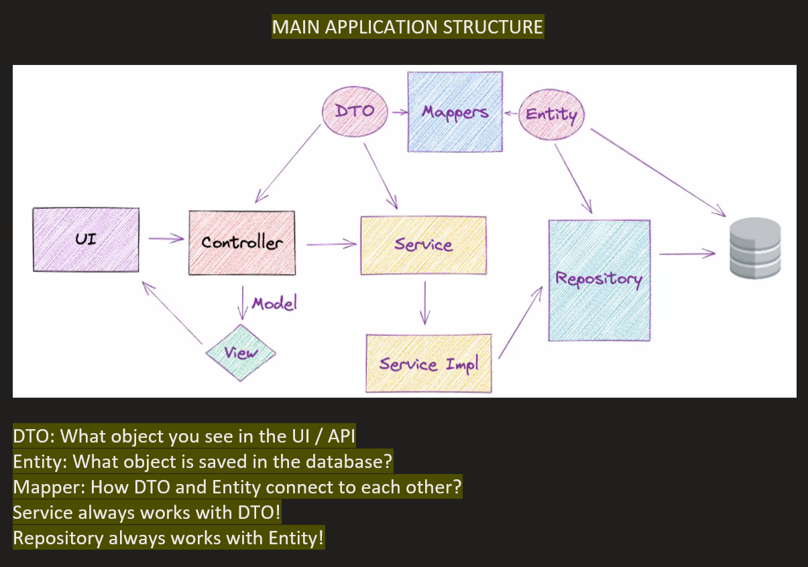
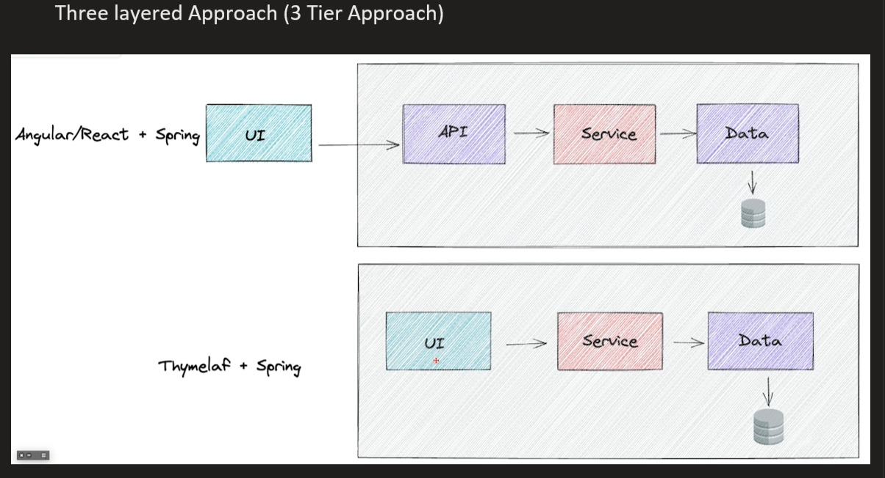
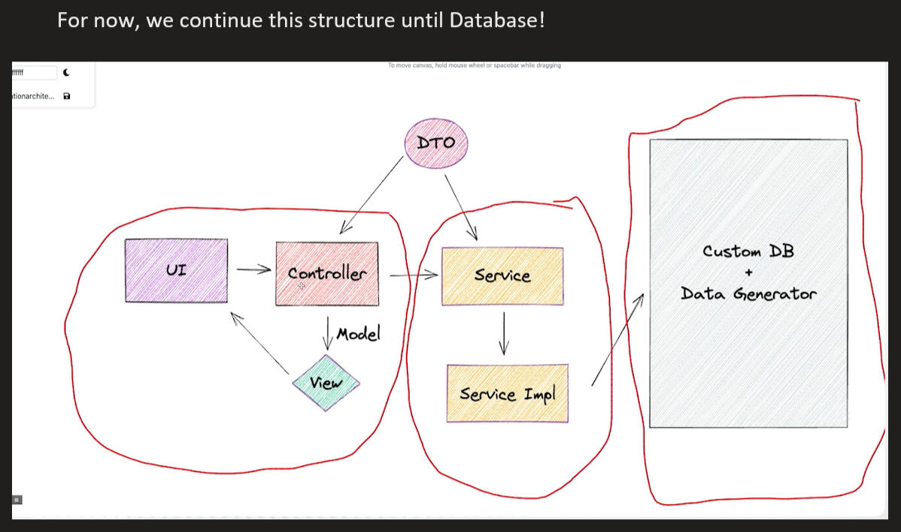
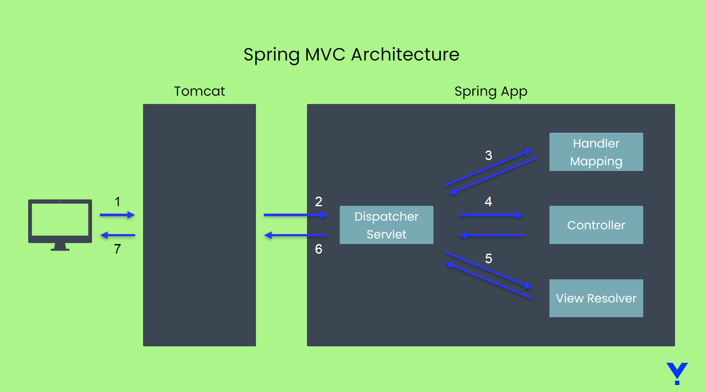
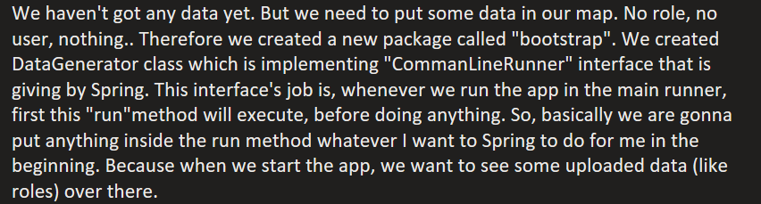

Ticketing Project (Project Management Tool) - MVC

• Servlet Container is a translator of the HTTP messages for our Java app. And this HTTP is gonna communicate between UI and DB.

• Tomcat (which is one of the famous server) is called a ‘Servlet Container’. Tomcat is already coming embeded and giving us already one servlet object when we create a spring boot application. (We don't need to create object also) This servlet object is doing all these translation job for us, HTTP to Java and Java to HTTP. 

• MVC Process: 

1. The client makes an HTTP request

2. Tomcat gets the client’s HTTP request. Tomcat has to call a servlet component for the HTTP request. Tomcat calls a servlet Spring Boot configured. This servlet is called as Dispatcher Servlet or Front Controller.

3. Dispatcher Servlet’s responsibility is to manage the request further inside the Spring App. It has to find what controller action to call for the request and what to send back in response to the client.

4. Dispatcher Servlet need to find the controller action to call for the request. To find out which controller action to call, the Dispatcher Servlet delegates to a component named Handler Mapping.

5. After finding out which controller action to call, the Dispatcher Servlet calls that specific controller action. The controller returns to the Dispatcher servlet the page name it needs to render for the response. We refer to this HTML page also as “view”

6. Dispatcher servlet delegates the responsibility of getting the view content to a component named View Resolver.

7. Dispatcher Servlet returns in the HTTP response the rendered view.

• All of them is done by Java except for Controller classes. Whenever we put @Controller annotation, everything all the methods inside is registering in the Handler Mapping. We put @RequestMapping annotation top of the methods with end points. Those methods return View Resolver.

• We cannot use same "endpoint" (@RequestMapping("/...") in different classes!

• Most famous template engine is Thymeleaf. Because it is built top of the html. So texts are not changing when you use it. You can use html tags with Thymeleaf because its extension is .html (But you cannot do that with JSP, its extension is .jsp).

• Thymeleaf is a Java-based library used to create a web application. It provides a good support serving an HTML5 in web application.

• To be able to integrate Thymeleaf with Spring Boot, we need to add the "spring-boot-starter-thymeleaf" dependency.

• We need to add the attribute ' xmlns:th=“http://www.thymeleaf.org" ' to <html> tag.

• This definition is equivalent to an import in Java. It allows us further to use the prefix “th” to refer to specific features provided by Thymeleaf in the view.

• We always put the thymeleaf tag inside the html tag!

• Whenever we need to move data from your method to thymeleaf, use model.addAttribute!

• Use "attributeName" in the Thymeleaf, not right away the data!

• Use @RequestParam when:

○ You need to pass multiple optional parameters.

○ You want to filter or sort results (e.g., search queries, filter options).

• Use @PathVariable when:

○ You need to specify a specific resource by ID.

○ The value is required and is a fundamental part of the URL structure (e.g., resource identification).

• Summary

• A dynamic page might display different content for different requests.

• To know what to display, a dynamic view gets the variable data from the controller.

• An easy way to implement dynamic pages in Spring apps is using template engine such as Thymeleaf.

• The client can send data to server through request parameters or path variables.

• A controller’s action gets the details sent by the client in parameters annotated with @RequestParam or @PathVariable.

General Project Definition

• A ticketing project is an application that organizes management processes.

• The application will allow client to create and manage users, projects and tasks.

Requirements

Features that are developing on the project are:

• User management:

• CRUD operations for users.

• Authentication of users. After we login, we will redirect users to the welcome page.

• The user will have a role assigned for it. Provided roles will be ADMIN, MANAGER,
EMPLOYEE.

1. ADMIN will be able to create and manage users.
2. MANAGER will be able to use all the parts related to projects such as creating a
   project, assigning a task to an employee, etc.
3. EMPLOYEE will be able to see all tasks related to him, and change the statuses of
   their assigned tasks.

Project

• CRUD operations for the project.

• Every project created will have a manager responsible for it. When creating a project you must assign a manager.

• The project will be able to have status. Provided statuses for project will be OPEN,
IN_PROGRESS, UAT_TEST, COMPLETE.

• The manager of the project will be able to create tasks for employees.

• The manager will be able to complete the project.

Task

• CRUD operations for the task.

• Every task created will have an employee responsible for it.

• When a task is created by the manager, it will be assigned to an employee.

• The task will be able to have status. Provided statuses for task will be OPEN,
IN_PROGRESS, UAT_TEST, COMPLETE.

• Employees will be able to change the status of the task depending on which phase it is.

• Employees will be able to see their own tasks and to start working on it.

• Employees will be able to see all of their archived tasks.

